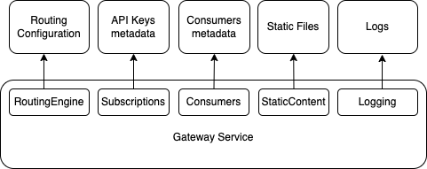

# Application configuration

Before this article check out [How SecuredAPI works](./Details.md)

## Basics
Application configuration is loaded during Secured API startup and configures global service behavior and crucial service components and access to the infrastructure. SecuredAPI implemented on asp.net and uses conventional .net configuration approach with json file and environment variables configuration configuration provider. That means that application uses json configuration (appsettings.json) as primary configuration that can be overridden by environment variables.

The main scenario supposes deploying SecuredAPI as docker image from docker hub that contains 'default' json configuration file, and everything is configured with environment variables. However, for the sake of simplification, configuration settings mostly will be described in json format. To define json attributes as a variable, just need to use __ as a separator in a variable name to mimic json hierarchy. For example: below json and environment vars define equivalent structure:

```json5
"Position": {
    "Title": "Editor",
    "Name": "Joe Smith"
  }
```

```
set Position__Title=Environment_Editor
set Position__Name=Environment_Rick
```

Detailed description how to configure asp.net apps is [here](https://learn.microsoft.com/en-us/aspnet/core/fundamentals/configuration/?view=aspnetcore-8.0#non-prefixed-environment-variables). 

See more meaningful example in [RoutingEngin section](#routingengine)

## Access to persistent storage
Most of dependencies (components) require access to the objects on the persistent storage, that's why this configuration element is widely used across configuration. These dependencies have ```FileAccess``` section in the appropriate configuration section. It responsible to define connection details. Mandatory attribute of the section is ```Type``` attribute that sets type of the storage that will be used. At the moment SecuredAPI supports to types of persistent storage:  ```FileSystem``` and ```AzureStorage```.

Overall format of the section looks like:

```json5
{
  "Component_Name": { //Section that configures some specific component
    "FileAccess": { // Mandatory section for the components
      "Type": "Type_Of_Persistent_Storage" // FileSystem or AzureStorage
      // FileAccess type specific configuration settings.
    }
    // Component specific attributes.
  }
}
```

#### FileSystem
Configures component to read and write objects into the specific location in the files system (local or mounted).

```json5
{
  "Component_Name": { //Section that configures some specific component
    "FileAccess": { // Section that will define access to the objects
      "Type": "FileSystem",
      "BasePath": "/home/user/disk2" // Optional parameter. defines path to the content where component will lookup for the objects. 
    }
    // Component specific attributes.
  }
}
```

*Important*: ```BasePath``` could be either absolute path or relative path to the application directory. Default is empty string, that means that component will use relative path to the application directory.

#### AzureStorage
Allows to setup service to read\write objects directly from\to specific blob in Azure Storage Account. At the moment, only RBAC access mode is supported, that takes default azure credentials, so following format is only allowed for this type of connection:

```json5
{
  "Component_Name": { //Section that configures some specific component
    "FileAccess": {
      "Type": "AzureStorage", //Forces app use Azure Storage Account
      "Rbac": { // Means that RBAC will be used
        "Uri": "https://teststorage.blob.core.windows.net/your_container" // Configures URI that contains storage account name and container.
      }
    },
    // Component specific attributes.
  }
}
```

See more meaningful example in [RoutingEngine section](#routingengine)

## Components configuration



#### RoutingEngine 
This is core component and only mandatory section of the config. Configures where Routing Configuration files are stored and how often they are reloaded.

```json5
{
  "RoutingEngine": { // section that defines routing configuration loading
    "FileAccess": {}, // Type of storage where configuration is deployed
    "Files": { 
      "RoutingCfgFileId": "routing-config.json", // Path to routing configuration file
      "GlobalCfgFileId": "global-configuration.json" //Optional. Path to global configuration file
    },
    "ReloadFrequency": 360000 // Optional. Defines how often routing configuration is reloaded in milliseconds. Default value is 300 000 ms (5 minutes)
  }
}
```

For, example, below snipped configures to load routing configuration file ```routing-config.json``` and global configuration file ```global-configuration.json``` from the azure blob storage ```teststorage``` in the container with name ```configuration``` :

```json5
{
  "RoutingEngine": { // section that defines routing configuration loading
    "FileAccess": {
      "Type": "AzureStorage",
      "Rbac": {
        "Uri": "https://teststorage.blob.core.windows.net/configuration"
      }
    },
    "Files": { 
      "RoutingCfgFileId": "routing-config.json", // Path to routing configuration file (in this case it's blob name)
      "GlobalCfgFileId": "global-configuration.json" // Path to global configuration file (in this case it's blob name)
    }
  }
}
```

To set this configuration using environment variables, you need following (linux notation)
```
export RoutingEngine__FileAccess__Type="FileSystem"
export RoutingEngine__FileAccess__Rbac__Uri="https://stcfgptstweeu.blob.core.windows.net/apigateway-config"
export RoutingEngine__Files__RoutingCfgFileId="routing-config.json"
export RoutingEngine__Files__RoutingCfgFileId="global-configuration.json"
```

Alternatively, below json snipped configures to load routing configuration file from the location ```%AppPath%/Configurations/default-routing-config.json``` and don't load any global configuration: 

```json5
{
  "RoutingEngine": {
    "Files": {
      "RoutingCfgFileId": "Configurations/default-routing-config.json"
    },
    "FileAccess": {
      "Type": "FileSystem"
    } 
  }
}
```

### Optional components

#### Subscriptions
Component handles API key authentication and required for [CheckSubscription](Actions.md#checksubscription) action. From technical standpoint, API Keys stored as json files with names equal to salted and hashed secrets. Files contain ids of allowed routes, id of consumer and other metadata associated with this API Key (secret). When SecuredAPI receives http call (and appropriate action is configured), CheckSubscription takes secret from the header, hashes it and loads appropriate file. If file doesn't exist, or requested route is not allowed then authorization or authentication are failed.

Component requires configuring of access to the API Key files and Salt that is used for hashing

```json5
{
  "Subscriptions": { //Section that configures component
    "Keys": { // Section that configures API Key access
      "FileAccess": { // See above options to configure file access
        "Type": "AzureStorage",
        "Rbac": {
          "Uri": "your url"
        }
      },
      "Security": {
        "Salt": "5b951d0869cc4d2da993b6d188197c71" // Salt that used to calculate hash
      }
    }
  }
}
```

#### Consumers
Component runs actions configured for this specific consumer and required (used) by [RunConsumerActions](Actions.md#runconsumeractions) action. From technical standpoint implemented consumers stored as json files, that contain list of actions that are executed by appropriate action. Filename is consumer id (guid) that is set by previous authorization action (for example [CheckSubscription](Actions.md#checksubscription))

Component requires configuring of access to consumer files.

```json5
{
  "Consumers": { // Section that configures component
    "FileAccess": { //Configures access to file storage; See FileAccess configuration options above
      "Type": "AzureStorage",
      "Rbac": {
        "Uri": "our uri"
      }
    }
  },
}
```

#### StaticContent
Component is used to serve static files and used by the [ReturnStaticFile](Actions.md#returnstaticfile) action.

Component requires configuring of access to the file storage, where static files are stored. Only one storage can be configured for the SecuredAPI instance

```json5
{
  "StaticFilesProvider": {
    "FileAccess": { // Configures access to file storage; See FileAccess configuration options above
      "Type": "AzureStorage",
      "Rbac": {
        "Uri": "your uri"
      }
    }
  }
}
```

#### Logging
TBD.

See [configuration](../../SecuredApi/WebApps/Gateway.IntegrationTests/appsettings-gateway.json) that used for the integration tests: