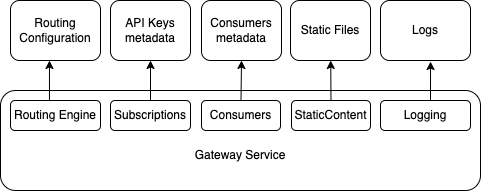

# Product details

To make decision if SecuredAPI suits for your application and properly setup and maintain it, it's important to understand how SecuredAPI works. 

# Routing

Whole SecuredAPI is build around very simple flow:
* First step: SecuredAPI receives http(s) request from client (client request object).
* Last step: SecuredAPI sends back response to the client (client response object).

Between these two steps SecuredAPI executes chain of operations that validates, reads and transform client request object and populates the client response object. The sequences of these operations and their parameters are configured by the application owner according to the application logic. To match the client request and the chain of operations, SecuredAPI uses HTTP method and request url path.

So, *the corner stone function of the SecureAPI*: for every incoming http request find configured chain of operations, execute them and send response back to client.

In the documentation the operations provided by SecuredAPI are called **actions**. The sequence of the actions and their parameters defined for the client requests is called **routing configuration**. HTTP Method and URL path pattern that match to the client http request is called **route**.

Configuration structure allows to define common operation that are executed for all requests, can define operations for group of requests matching specific pattern, or define logic for just one specific client call. To match client requests to the appropriate logic SecuredAPI uses URL path and HTTP method.

In SecuredAPI actions can be split into two groups: fallible and infallible. Fallible actions implement conditions and in some circumstances 'fails' and stops the success execution sequence. Infallible doesn't have any conditions and has no effect to the further execution.

Routing configuration defines two action execution flows for every route: successful flow and error flow. Successful flow is a flow that SecuredAPI processing starts with. This is the happy path scenario and implements main gateway logic. If all actions are succeeded, once last action in success flow is completed, SecuredAPI returns response object to the client. If during success flow execution fallible actions identify error, successful flow stops and SecuredAPI starts executing error flow. Routing configuration has tree-like structure and so, when SecuredAPI switches to error flow, execution starts on the level where error occurred.

See also:
[Routing Configuration](./RoutingConfiguration.md)
[Actions](./Actions.md)

# Components and Dependencies

SecuredAPI is designed as simple and straightforward as possible, however has a different components that depends on the communication with the infrastructure. For example SecuredAPI service has to know where\how to load routing configuration. In addition several actions work on top of the components that uses external infrastructure and services, that obviously require configuration too. To configure SecuredAPI in efficient and cost effective way it's important to understand main application building blocks and dependencies.

Gateway service obviously is a central part of the SecuredAPI solution. At the startup Gateway applies (application configuration)(./ApplicationConfiguration.md), that includes configuration of connection to the dependencies. Once application is started, it loads [routing configuration file](./RoutingConfiguration.md) together with parameters (called [global configuration](./GlobalVariablesConfiguration.md)). Once routing configuration is loaded and applied, service can process [incoming requests](./Routing.md).

1. Routing Configuration is the only mandatory dependency of the Gateways service. Configuration consists of the path to routing configuration file (required) and path to the global variables configuration file (optional). Service load and apply this configuration right after startup and reloads it according configured time interval.

2. API Keys is optional dependency needed only if you use API Key authentication mechanism. It's designed as a file storage, where name of the file is hash of api key, and content is a json with subscription metadata that defines access rights to your api, consumer id, etc.

3. Consumers. Optional, only if authentication is used and if gateway requires consumer specific behavior. Implemented as file storage with files, where file name is consumer id, and content is json with consumer metadata, including list of actions executed for this specific consumer.

4. Static files. Optional, only if gateway is used to serve static content (e.g. html, files, etc.). It is designed as file storage and allows subfolders. 

Dependencies (1) - (4) need to be configured on service startup by the application configuration and can't be changed without service restart. Each of these dependencies can be configured either as a path to separate folder on file system (in (1) it's a path to individual files), or as a separate container on the azure blob storage (or paths to the blobs in the same container in (1)). Dependencies (2) - (4) can configure only one location, i.e. static files can be spreed across different containers, and has to be stored in one containers, but in different subfolders.

Access to storage accounts can be configured only with Azure [System Assigned Managed Identity](https://learn.microsoft.com/en-us/entra/identity/managed-identities-azure-resources/overview)

5. Logs is optional but recommended dependency. It can be configured to write logs into file system and optionally to the App Insights.

# How to use

The main approach considered is deploying official SecureAPI images from the docker hub, set application configuration as a environment variables by deployment scripts and routing configuration as separate blobs on the storage account or possibly as files on attached common drive to your docker containers. This scenario is simplest where when application owner don't need maintain own build pipelines, application and routing configuration are decoupled and routing configuration can be changed without redeployment of the service.

The second possible approach is to build own docker image basing on the SecuredAPI image from the docker hub. In this case application owner can add own application configuration files and optionally routing configuration just to the docker image. Potentially, application configuration files (that are json files) can be easier to write maintain then environment variables, however it will require maintaining own build pipeline and own docker container registry and needs rebuilding and redeployment on every app configuration change. 

The last possible scenario is build and configure your own container from the scratch. In this case it's technically possible to even make some corrections to the source code and application logic (pay attention to the [license](./../../LICENSE.txt) and copyright).

Documentation is focused on the approach 1.

Further read:
[Routing Configuration](./RoutingConfiguration.md)

[Application Configuration](./ApplicationConfiguration.md)