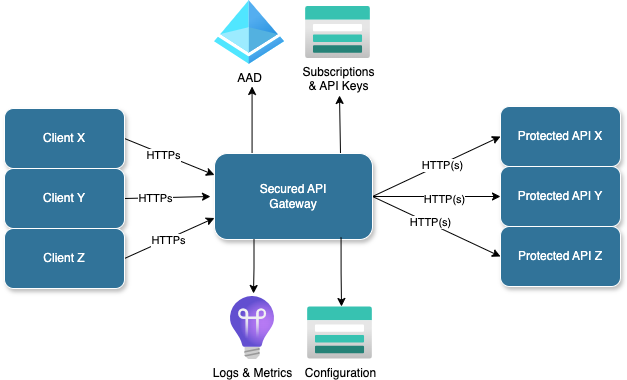

Check out [github repository](https://github.com/PKPublicCode/SecuredApi) for the [documentation](https://github.com/PKPublicCode/SecuredApi/blob/main/README.md) and sources.

# SecuredApi

Simple (in terms of usage), cheap (no hard dependency on expensive services and solutions), PaaS compatible and code-first friendly API Gateway solution to offload routine operation for medium loaded HTTP(s) services.

__Current focus is compatibility with Azure stack. Compatibility with other clouds and 3-rd party services will be coming later.__

Having SecuredAPI in front of HTTP services allows to:
* Offload authentication and authorization using:
    * API Key and subscriptions
    * JWT tokens and claims (Azure Entra Only)
* Add and\or remove HTTP headers in request before sending to api services
* Add and\or remove HTTP headers in response before returning it to client
* Restrict client access by inbound IP address
* Serve content, stored as blobs on azure stored account or as files on file system
* Return content defined in the configuration inline
* Configuring any of above for individual customers (API Keys authentication only).

As a side effect of above, SecuredAPI can be used to host mock\stub service(s) for different integration testing scenarios.

Gateway routing rules are stored in a separate file(s), and can be updated and uploaded without SecuredAPI redeployment. All rules are defined using json format, supposed to be manually edited, stored in the source control and uploaded either by deployment pipelines or manually. Ability to parametrize routing configuration allows to reuse them for different environments and deployment stamps. Learn [here](./Docs/Product/Details.md#routing) how SecuredAPI works.

The only infrastructure requirement for SecuredAPI is just any hosting infra and persistent storage. The main scenario considered is an Azure App Service or Kubernetes and Azure Storage Account. Also, persistent storage can be mounted as a disk volume. Find more details about components and dependencies [here](./Docs/Product/Details.md#components-and-dependencies)

SecuredAPI is available as a docker [images](https://hub.docker.com/repository/docker/pkruglov/securedapi.gateway) that can be easily deployed and configured by environment variables. Obviously, own docker images can be build and deployed, if official builds don't suit for solution.

Integration with Application Insights available out of the box can be leveraged for monitoring and further analysis of service metrics.

## Performance
Check out load testing [results](./Docs/Product/Performance.md). 

## License
This program is free software: you can redistribute it and/or modify it under the terms of the [Server Side Public License, version 1](./LICENSE.txt)

License explanation can be found [here](https://www.mongodb.com/licensing/server-side-public-license/faq)

License copied from [MongoDB github](https://github.com/mongodb/mongo/blob/master/LICENSE-Community.txt)

### Documentation
[How SecuredAPI works](./Details.md)

